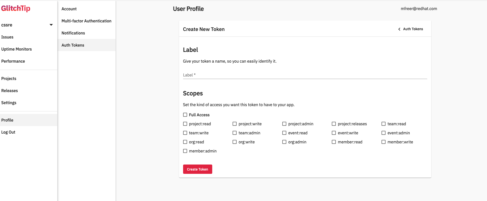

# Glitchtipcli
Glitch-tip Error tracking software command-line tool in python click. 


## Prerequisites 
- Please review glitchtip [API Documentation](https://app.glitchtip.com/docs/)
- Python 3.8
- Click 
- Docker

## Features Remaining - (TODO)

- Push to PyPi
- Containerized cli tool.
- Make upstream changes to glitchtip backend to enable api token removal feature flag.
- Create a reporting feature flag
- Create a Jira integration


## To run Glitchtip commandline tool local setup.

- **Step 1.** Clone this repository and run the following command and setup a virtual environment.

```
mkdir -p env

source env/bin/activate


```


- **Step 2.** Install all the python package requirements.


```
sudo pip install -r requirements.txt
pip freeze > requirements.txt

```

- **Step 3.** Setup and `.env` file in the root of the source codes directory. Remeber to included it in your `.gitignore` file.

- **Step 4.** Generate a Gltich-tip API Token from your Glitchtip instance. Login into your hosted or self hosted Glitchtip instance in the appropriate organization.

- **Step 5.**  **Goto** --> **Profile** --> **Auth Tokens**

- Click `Create New Token` button and give your `Auth Token` a name and apply the appropriate permissions.



- **Step 6.** Add the appropriate environment variable to a `DOTENV` file

**Example**

```

PROJECT_API_KEY='Your API TOKEN Here'
STAGING_URL='Staging'
PRODUCTION_URL='Production'

```

- Alternatively export as environment variables.


```
export PROJECT_API_KEY='Your API TOKEN Here'

export STAGING_URL='Staging'

```


```
python glitchtipcli.py 
   _________ __       __    __  _     
  / ____/ (_) /______/ /_  / /_(_)___ 
 / / __/ / / __/ ___/ __ \/ __/ / __ \
/ /_/ / / / /_/ /__/ / / / /_/ / /_/ /
\____/_/_/\__/\___/_/ /_/\__/_/ .___/ 
                             /_/      

GT, Open Source Error Tracking Software! ☕ By Mark Freer
Usage: glitchtipcli.py [OPTIONS] COMMAND [ARGS]...

  A Glitch-tip Command line tool to query the Glitch-tip Error tracking
  software API.

Options:
  --help  Show this message and exit.

Commands:
  create-organization  Creates a new glitchtip organization
  create-project       Creates a new glitchtip Project
  create-team          Creates a new Team in glitchtip under your...
  create-user          Creates a new glitchtip User associated with an...
  delete-organization  Delete a glitchtip organization
  delete-project       Delete a glitchtip project
  delete-team          Delete a glitchtip team
  list-members         This returns the list of glitchtip projects members
  list-organizations   This returns the list of glitchtip Organization...
  list-projects        This returns the list of glitchtip projects
  list-teams           This returns the list of glitchtip teams
  list-tokens          Get the list of Glitchtip API tokens
  list-users           This returns the list of glitchtip specific org users

```


## Dev workflow

- TBD 

```
autopep8 --in-place --aggressive --aggressive glitchtipcli.py 

```

Please review the glitchtip contribution guideline for [Getting-started.md](https://gitlab.cee.redhat.com/cssre/cssre-docs/-/blob/main/development/howto/glitchtip/getting-started.md)